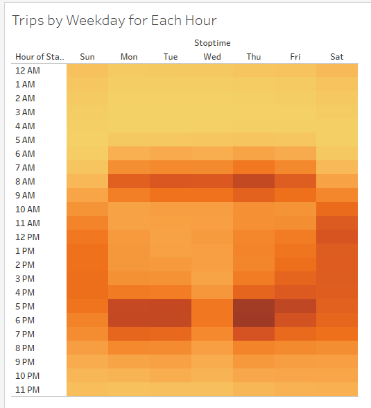

# Analysis of Bike Sharing Service, Citibike, in New York in August 2019

## Overview
This analysis serves to examine the business that Citibike does in New York during a sample month, to evaluate the potential of opening a similar business in Des Moines, Iowa. We looked at many different factors of the Citibike business, to better understand the potential and users of this service. This will help us convince investors to become involved in our project, and help us design our own service to match customer needs.

## Results
The visualizations of the data looked at can be seen [here](https://public.tableau.com/app/profile/david.a4605/viz/DANYCitibikeTableau/KeyOutcomesofAnalysis):

[link to Tableau data visualizations](https://public.tableau.com/app/profile/david.a4605/viz/DANYCitibikeTableau/KeyOutcomesofAnalysis)

### Visualizations

The most common trip duration is short: 5-6 minutes. There is a sharp dropoff before one hour, showing that the bikes are not often used for long trips, or long periods.

This trip duration holds true across gender lines, although men are the primary customers for Citibike in New York. Women do use bikes at similar time intervals, but less often.

Bike rentals during weekdays occur heavily around 7-9AM, and again from 5-7PM. This suggests they are often used for commutes. Weekends have less clear useage spikes, instead being used throughout the day.

Men and women have similar overall rental patterns, although again, we can see that that most rentals are taken by men.

Infrequent or one time customers rent less often, and not in predictable patterns, while subscribers tend to be men, and rent most heavily on Thursdays and Fridays. The high subscriber usage suggests that it is not just tourists using the bikes, so the lower tourism in Des Moines should not prevent success.

Bikes by Citibike in New York are not used evenly; a small number of bikes are riden for much longer periods total, while the majority of bikes are ridden much less in sum. It will be a few key bikes in need of regular repair and maintainence. 

The heavy focus on certain bikes is likely explained by the most common places to rent bikes; Manhattan, and specifically all parts south of Central Park (tends to be more commercial). We should focus on deploying bikes in commercial areas.

## Summary

Rides tend to be short, the users of the service tend to be male, and it appears the biggest use case and timing is for commuting to typical business hour jobs. The analysis concludes that we should focus our business on commuting men to see similar success to that of Citibike in New York, and since there are also plenty of male commuters in Des Moines, we should be able to find success.

### Additional Suggested Visualizations

One additional visualization we could generate might look at the user type by starting point. This might help us understand the difference between subscribed customers, who are regular users of the service, and those one-off customers, who are less likely to be our focus, and more likely to be tourists.

We should also consider looking at a wider array of months, to see if use cases vary over time and throughout the year. Colder months are likely to negatively impact business, but by how much? Starting when? Such a visualization could help us better prepare for spikes and dips in our prospective business.
